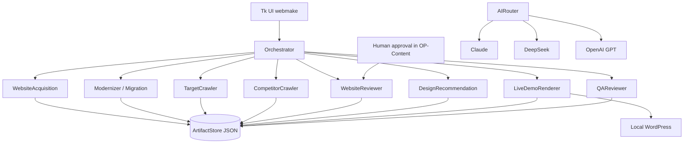

# WebMaker

WebMaker is a local Windows tool that crawls a public business website, analyzes it with AI, and builds a WordPress demo you can review on your machine before anything reaches a client’s production site.

The main idea is simple: show a concrete before-and-after, with a human approval step between AI recommendations and the rendered demo.

## Overview

When I work with service businesses, the bottleneck is rarely “can we crawl the site?” It is “can we show a better version without rebuilding everything by hand or deploying unfinished work?”

WebMaker is my answer to that workflow problem. You give it a public URL (and optionally competitor URLs). It acquires the site into a structured package, can migrate or modernize into a local WordPress theme, runs business and competitor analysis, proposes content changes, and only applies what you approve.

It is a presentation and development tool that runs on your computer. It is not a hosted SaaS and it does not publish to the client’s live server.

## Why I built this

I wanted one place where crawl, analysis, content review and a runnable WordPress demo live together.

Most pieces of that pipeline are easy in isolation. The hard part is keeping them honest with each other: typed artifacts between steps, a clear human gate before render, and a local demo stack that does not depend on someone else’s hosting.

So the system is built around an orchestrator that runs single-responsibility agents. Agents do not call each other. They read upstream artifacts, write new ones, and stop if something required is missing or invalid.

## Key capabilities

- **Website acquisition** with Playwright: pages, HTML/DOM, assets, brand cues, layout signals, screenshots, then a validated website package
- **Migrate / modernize** into a local WordPress theme (theme and template selection in the UI)
- **Business analysis** (Claude) and **competitor structure** analysis (DeepSeek)
- **OP-Content review**: AI recommendations you tick to approve before render
- **Live demo render** that patches approved copy into existing optimized page JSON (with a backup for undo). Render itself does not invent new copy
- **QA agents** for content and visual checks against the demo
- **Local WordPress stack** via portable PHP, MariaDB and WP-CLI (installed by setup scripts, not shipped in git)

## Architecture

Primary control flow:



What matters in the design:

1. **Orchestrator** (`webmaker/orchestrator/`) owns order and IO.
2. **ArtifactStore** keeps one typed JSON file per artifact under `projects/<slug>/artifacts/`.
3. **Pydantic schemas** (`webmaker/schemas/`) validate inputs and outputs.
4. **AIRouter** (`webmaker/modules/ai_router.py`) is the only place provider SDKs are used. Tasks have preferred providers (for example business analysis → Claude, competitor analysis → DeepSeek, design / visual QA → OpenAI), with fallback when `AI_PROVIDER=auto`.
5. **ProjectManager** still handles project folders and state. The V2 path prefers the orchestrator for agent runs.

More detail: [`docs/architecture.md`](docs/architecture.md) and [`ARCHITECTURE.md`](ARCHITECTURE.md).

## Desktop UI

Launch with `.\webmake` (or `python run.py webmake`). The Tk app currently has four tabs:

1. **Crawl:** acquire and validate the website package (no AI)
2. **Migrate:** theme/template selection and migration / modernizer build
3. **Analyze:** business + competitor analysis
4. **OP-Content:** review recommendations, approve tips, render into the demo

There is also a CLI for the local stack (`python run.py start|stop|verify|info`).

## Tech stack

| Area | Implementation |
|------|----------------|
| Language | Python 3.10+ |
| UI | Tkinter |
| Crawl | Playwright |
| Validation / config | Pydantic, Pydantic Settings, `.env`, `config/webmaker.yaml` |
| AI | Anthropic, DeepSeek, OpenAI (Gemini adapter exists, not the V2 default path) |
| Demo CMS | WordPress via local PHP + MariaDB + WP-CLI |
| Tests | pytest (unit suite under `tests/unit/`, integration needs the local stack) |

`streamlit` appears in `requirements.txt` from earlier scaffolding. The day-to-day UI is the Tk app.

## Installation

Target environment today: **Windows 10/11** with PowerShell.

```powershell
cd WebMaker
python -m venv .venv
.\.venv\Scripts\Activate.ps1
pip install -r requirements.txt
python -m playwright install chromium
Copy-Item .env.example .env
```

Put your API keys in `.env`, then install the local WordPress runtime:

```powershell
.\setup\setup.ps1
python run.py verify
```

## Configuration

Copy `.env.example` to `.env`. Do not commit `.env`.

| Variable | Role |
|----------|------|
| `CLAUDE_API_KEY` | Business analysis, review, content QA |
| `DEEPSEEK_API_KEY` | Competitor analysis |
| `GPT_API_KEY` | Design recommendation, visual QA |
| `GEMINI_API_KEY` | Optional / legacy |
| `WP_ADMIN_USER` / `WP_ADMIN_PASS` | Local WordPress admin on first setup |
| `WEB_PORT` / `DB_PORT` | Defaults `8080` / `3307` |

See `config/webmaker.yaml` and `webmaker/config/settings.py` for the full surface.

## Usage

```powershell
python run.py start          # MariaDB + PHP, demo at http://localhost:8080
.\webmake                    # UI + open demo browser
python run.py verify
python run.py info
python run.py stop
```

Typical flow:

1. Enter a public target URL and a project name.
2. Run **Crawl** until the website package validates.
3. Use **Migrate** to build into the chosen theme.
4. Optionally run **Analyze** for business / competitor context.
5. In **OP-Content**, run review, tick tips, render approved changes.
6. Open `http://localhost:8080` and walk the demo.

Project workspaces live under `projects/` on your machine. That directory is fully gitignored so client data never ships with this repository.

## Project structure

```text
WebMaker/
├── run.py, webmake.ps1      CLI + launcher
├── webmaker/
│   ├── agents/              V2 agents (acquisition, migrate/modernize, review, render, QA, …)
│   ├── orchestrator/        Orchestrator + ArtifactStore
│   ├── modules/             Crawler, analyzers, AIRouter, WordPress generator, …
│   ├── schemas/             Pydantic artifacts
│   ├── ui/tk_app.py         Desktop UI
│   ├── config/              Settings
│   └── data/                Theme / pattern catalogs
├── prompts/                 Markdown system prompts
├── setup/                   Python + PHP/MariaDB/WordPress setup and verify
├── tests/                   Unit and integration tests
├── docs/                    Architecture notes
├── config/webmaker.yaml
└── projects/                Local only (gitignored)
```

## Testing

```powershell
.\.venv\Scripts\Activate.ps1
pytest tests/unit/ -q
```

Integration tests expect the local MariaDB/PHP environment to be up.

## Limitations

- Setup and launch scripts are Windows-first.
- The full AI path needs third-party API keys and network access.
- WordPress, PHP and MariaDB are installed locally by setup. They are not in the public git tree.
- Demo quality still depends on the source site and which OP-Content tips you approve.
- This prepares a local demo. It does not claim SEO rankings or production hosting.

## What this demonstrates

For readers looking at this as portfolio work, the interesting parts are the agent boundaries, typed artifact store, provider routing with task affinity, human-in-the-loop render path, and the practical local WordPress demo stack around it.

## License

Proprietary source-available. See [`LICENSE`](LICENSE).

You may view and run the code for personal, non-commercial evaluation.
Commercial use requires prior written permission.

Third-party components you install locally (WordPress, themes, plugins, PHP, MariaDB) keep their own licenses.
